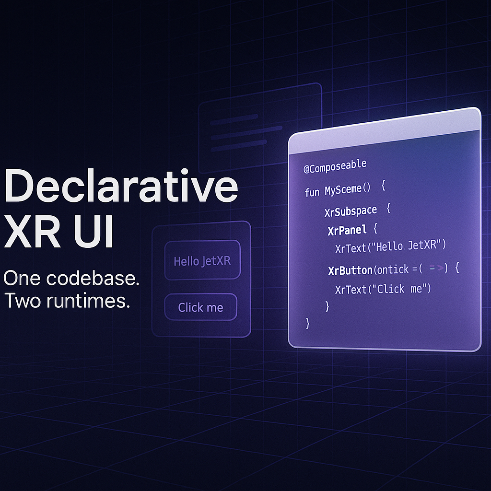

# JetXR

  

> Compose-style cross-platform XR UI framework for Kotlin targeting Android XR and Meta Quest

JetXR lets developers write one declarative Kotlin UI for XR apps, then deploy it to Android XR and Meta Quest using Jetpack Compose-style APIs.

## Features
- Declarative Compose-style XR UI DSL
- Android XR + Meta Spatial SDK support
- Modular architecture with overrideable implementations
- Example apps for each target

## License
Apache 2.0
